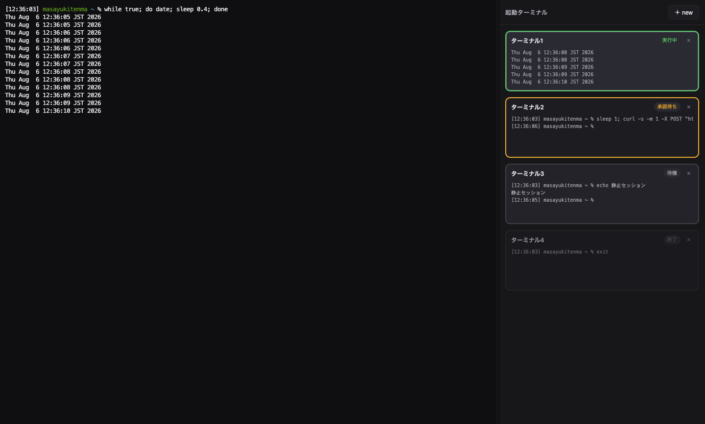

# Claude Term

Claude Code 用途に特化したターミナルアプリ(macOS / Apple Silicon)。デスクトップがターミナルウィンドウだらけになる問題を、**1ウィンドウ = メイン表示 + セッションカード一覧** で解決します。



- 左: メインターミナル(フル表示)
- 右: 起動中セッションのカード一覧(画面末尾5行のプレビュー付き)
- カードの枠色でセッション状態が一目で分かる:

| 状態 | 枠色 | 意味 |
|---|---|---|
| 実行中 | 緑 | Claude Code が処理中(または出力が流れている) |
| 承認待ち | オレンジ(点滅) | ツール承認や入力待ちで止まっている。**見るべき** |
| 待機 | グレー | プロンプトに戻って静止している |
| 終了 | 暗色 | シェルが異常終了した(正常な `exit` はカードごと自動で閉じる) |

- 承認待ちになると **macOS 通知**が届き、**Dock アイコンに承認待ち件数のバッジ**が付きます。通知クリックでそのセッションに直接ジャンプ
- カードには claude の**モデル名・コンテキスト残量・累計コスト**も表示されます(statusLine 連携。コンテキスト残 20% 以下でオレンジ表示)
- カードタイトルはセッションの**現在のディレクトリ名**(`cd` に追随)

カードをクリックするとそのセッションがメインにフル表示され、裏のセッションも動き続けます。「＋ new」は素の zsh ログインシェルを即座に開きます。`cd` での移動や `claude` / `codex` の起動は通常のターミナルと同じように自分でコマンドを打ちます。

**改行入力の支援**(claude 実行中のセッションのみ・hooks 連携が必要): claude への入力中は「**行末スペース + Enter**」または「**Shift + Enter**」で送信せずに改行できます。通常のシェル操作では介入しません。

## インストール

### A. ビルド済み DMG(Releases からダウンロード)

[Releases](../../releases) から `Claude Term-<version>-arm64.dmg` をダウンロードし、開いて `Claude Term.app` を Applications にドラッグしてください。

**重要**: 配布物は ad-hoc 署名(Apple の公証なし)のため、ダウンロード後そのまま開くと macOS に「開発元を確認できない/壊れている」と拒否されます。インストール後に一度だけ以下を実行してください:

```sh
xattr -cr "/Applications/Claude Term.app"
```

(またはシステム設定 → プライバシーとセキュリティ → 「このまま開く」)

### B. ソースからビルド(推奨・警告なし)

必要環境: macOS (Apple Silicon) + Node.js 20+

```sh
git clone https://github.com/mtenma/claude-term.git
cd claude-term
npm install
npm start            # そのまま起動(開発モード)
npm run package      # release/ に自分用の .app と DMG を生成
```

自分のマシンでビルドしたアプリは Gatekeeper の警告なしで起動できます。

## Claude Code の状態検知(hooks / statusLine 連携)

「承認待ち=オレンジ」の正確な検知とメトリクス表示のため、初回起動時に同意ダイアログを出した上で `~/.claude/settings.json` に **ガード付き hooks(6件)** と **statusLine 設定** を追記します。

- 追記されるコマンドはすべて次の形式です(`# claude-term-state-hook` マーカー付き):

  ```sh
  [ -n "$CLAUDE_TERM_PORT" ] && curl -s -m 1 -X POST "http://127.0.0.1:$CLAUDE_TERM_PORT/state/$CLAUDE_TERM_SESSION/<state>" >/dev/null 2>&1 || true # claude-term-state-hook
  ```

- `CLAUDE_TERM_PORT` は Claude Term のセッション内にだけ存在する環境変数です。**通常のターミナル(iTerm2 等)で claude を使うときは何も実行されません**(ガードで no-op)。
- 対象イベント: `UserPromptSubmit` / `PreToolUse` / `PostToolUse` → 実行中、`Notification`(permission_prompt|elicitation_dialog|agent_needs_input)→ 承認待ち(通知に要求内容を表示)、`Stop` → 待機、`SessionEnd` → 検知解除
- `idle_prompt`(応答完了後の放置)は意図的に対象外です。放置は「待機(グレー)」のままにし、オレンジは「あなたの操作がないと進まない」状態だけを意味します
- statusLine: `~/.claude/claude-term-statusline.sh` を設置し、`settings.json` の `statusLine` が**未設定の場合のみ**設定します(独自の statusLine を使っている場合は一切触れません)。スクリプトは Claude Term のセッション内でのみ動作し、セッション情報 JSON をアプリへ転送してモデル名・コンテキスト残量・コストをカードに表示、claude の画面にも同じ内容のステータス行を出します
- 書換え前の内容は `~/.claude/settings.json.backup-claude-term` に保存されます。

### 削除手順

`~/.claude/settings.json` から `claude-term-state-hook` を含む hook エントリと `statusLine` 設定(`claude-term-statusline` を含む場合)を削除し、`~/.claude/claude-term-statusline.sh` を消すだけです。同意をやり直したい場合はアプリの設定ファイル(`~/Library/Application Support/Claude Term/config.json`)の `hooksConsent` を消してください。

hooks を追記しない場合もアプリは動作します(出力の有無による実行中/待機の判定と、ターミナルベルによる要注目検知のみになります)。

## 開発

```sh
npm run check   # 型検査
npm run smoke   # SessionManager のスモークテスト(GUI 不要・attach 切替の欠落/重複ゼロを機械検証)
CLAUDE_TERM_SCREENSHOT=/tmp/s.png CLAUDE_TERM_DEMO=states npm run shot  # 自動スクリーンショット
```

### アーキテクチャ概要

- Electron + node-pty + xterm.js。メインプロセスが全セッションの PTY を保持し、各セッションに `@xterm/headless` のミラー端末を並走させる(VS Code のターミナル復元と同じ構成)
- カード切替時は `@xterm/addon-serialize` のスナップショットを renderer に送って xterm を復元し、以後はそのセッションの生データのみ転送
- 全 PTY はメイン表示の cols/rows に常時揃えるため、切替時に再折返し崩れが起きない

## 既知の制限

- プレビューはテキストのみ(色は反映されない)
- Codex は通常のコマンドとして動作するが、状態検知は出力ヒューリスティックのみ(hooks 連携は Claude Code のみ)
- 配布パッケージ(.app)は未対応。`npm start` で起動する
